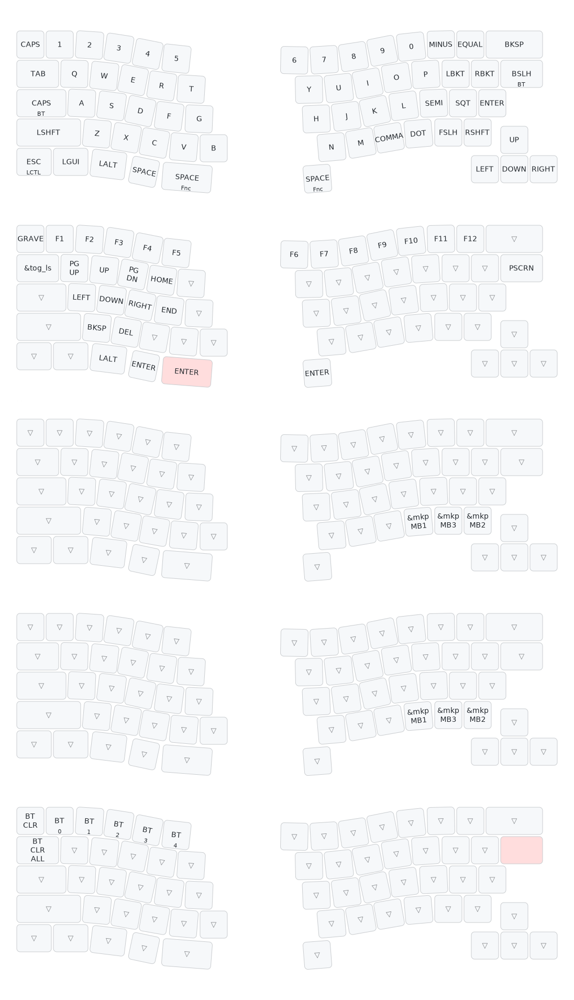
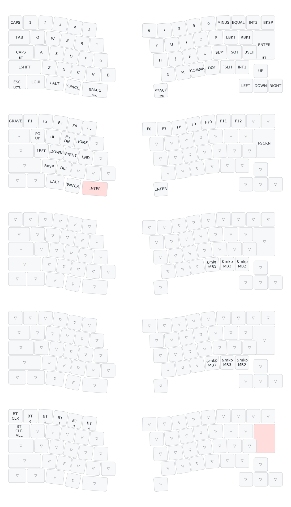

# キーボードについて
キーボード名：GeaconSolstice  
[roBa](https://github.com/kumamuk-git/roBa)や、[GRIN One](https://note.com/policium/n/nc7ceb56d11fe)にインスパイアされて設計したGeaconを、さらに発展させたオリジナルキーボードです。

## 謝辞
トラックボールケースはkepeoさんのデータを利用させていただきました。  
[Keyball Trackball Case (Test) by kepeo - Thingiverse](https://www.thingiverse.com/thing:6749719)  
トラックボール基板はkumaさんの設計したデータを利用させていただきました。  
[GitHub - kumamuk-git/roBa](https://github.com/kumamuk-git/roBa)  

## 特徴
・ZMKによる無線接続対応  
・60%分割Grin配列  
・トラックボール、OLED、アナログスティック搭載  

### US配列

### JIS配列

## 販売
たぶん[booth](https://te9no.booth.pm/)で販売  

## ビルドガイド
[here](https://github.com/te9no/zmk-config-GeaconSolstice/blob/main/docs%2Fbuildguide.md)

## ファームウェア
[Github](https://github.com/te9no/zmk-config-GeaconSolstice/tree/main/firmware)  

## 注意事項
リポバッテリーを不適切に取り扱うと発火等の危険性があります。  
接続時の極性の向きや、リード線の短絡、組み立てには十分ご注意下さい。  
またPCBやケースの角、ピンヘッダーなど鋭利な箇所が多数存在していますので、怪我しないようご注意下さい。  
マイコン裏のパッドはバッテリーに接続されてるため、短絡させないようご注意下さい。  
取り扱いの不備により発生した怪我、事故等の責任は負いかねます。
